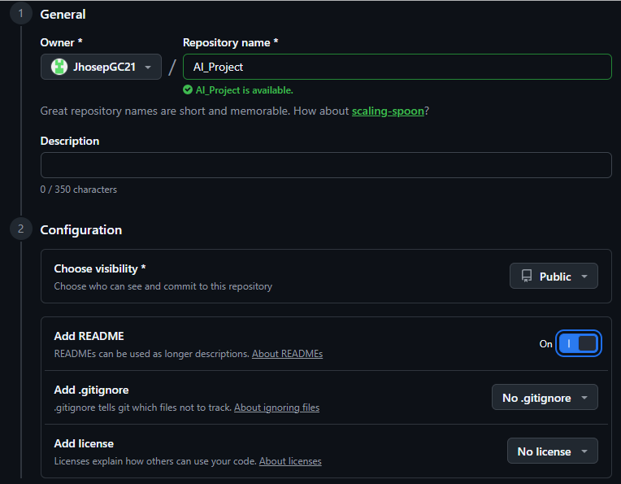
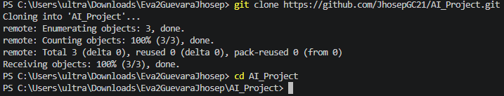
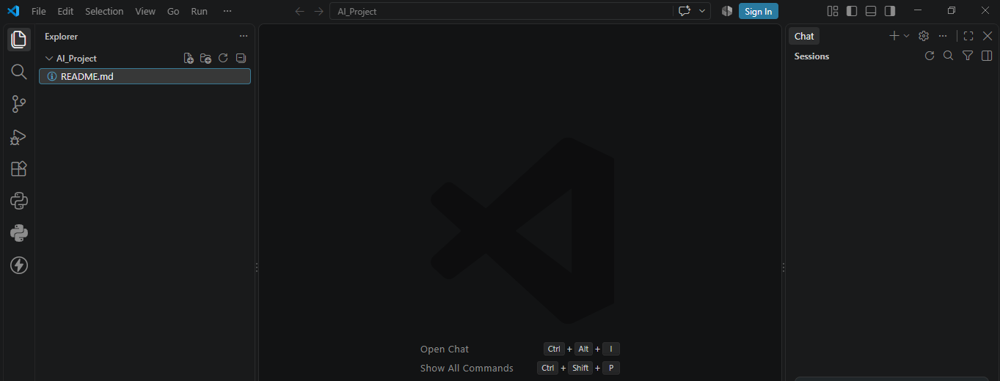
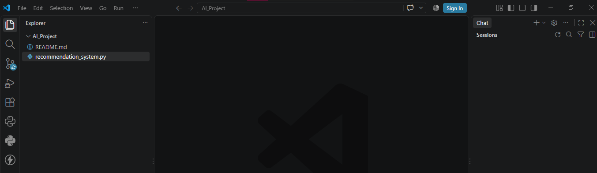
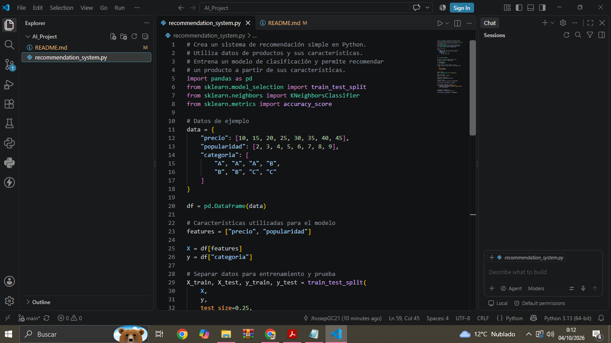
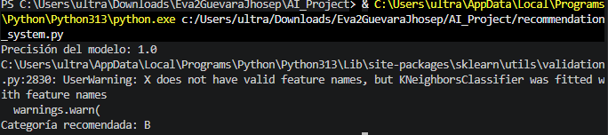
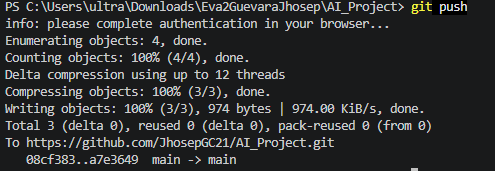

# AI_Project

## Actividad formativa: GitHub Copilot

### Estudiante

**Nombre:** Jhosep Yampier Guevara Coronel  
**Asignatura:** Inteligencia Artificial Generativa  
**Institución:** INACAP

---

## 1. Objetivo

El objetivo de esta actividad es explorar las capacidades de GitHub Copilot como herramienta práctica para el desarrollo de un sistema de recomendación utilizando Python.

---

## 2. Herramientas utilizadas

- GitHub
- GitHub Copilot
- Visual Studio Code
- Python
- Pandas
- Scikit-learn
- Git

---

## 3. Creación del repositorio

Se creó un repositorio en GitHub llamado **AI_Project**. El repositorio fue configurado como público y se agregó inicialmente un archivo README.

### Evidencia



---

## 4. Clonación del repositorio

El repositorio fue clonado localmente utilizando Git desde el terminal de Visual Studio Code mediante los siguientes comandos:

```bash
git clone https://github.com/JhosepGC21/AI_Project.git
cd AI_Project

```
### Evidencia



---

## 5. Apertura del proyecto en Visual Studio Code

El repositorio fue abierto correctamente en Visual Studio Code para comenzar el desarrollo del proyecto.

### Evidencia



---

## 6. Creación del archivo de Python

Se creó el archivo `recommendation_system.py`, destinado al desarrollo del sistema de recomendación.

### Evidencia



---

## 7. Uso de GitHub Copilot

Se utilizó GitHub Copilot como herramienta de apoyo para generar el código inicial del sistema de recomendación.

Posteriormente, el código fue revisado y ejecutado en Visual Studio Code.

### Evidencia



---

## 8. Funcionamiento y resultado

El programa utiliza datos de productos y sus características para entrenar un modelo de clasificación.

Al ejecutar el programa se obtuvo:

**Precisión del modelo: 1.0**

**Categoría recomendada: B**

### Evidencia



---

## 9. Control de versiones

Los archivos fueron agregados al repositorio mediante Git.

Posteriormente se realizó un commit y finalmente los cambios fueron enviados al repositorio remoto mediante `git push`.

### Evidencia



---